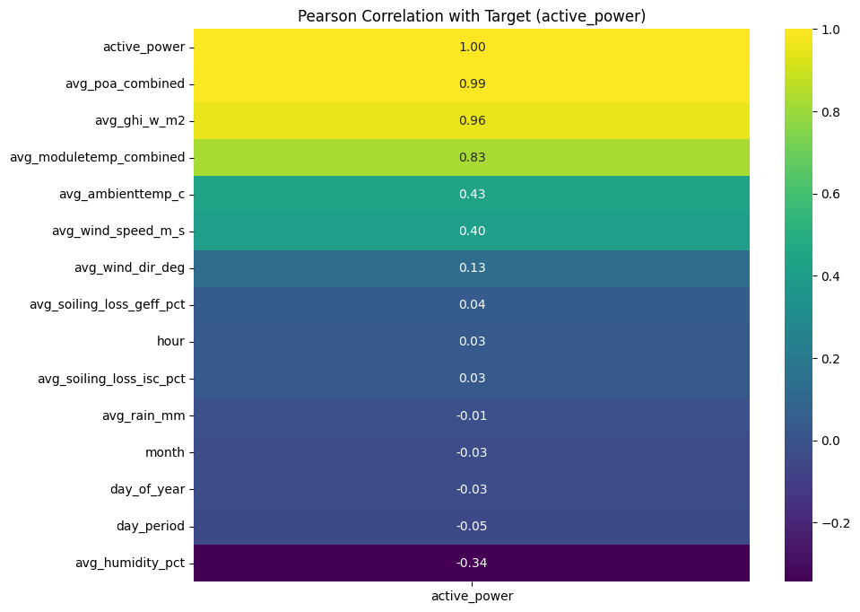
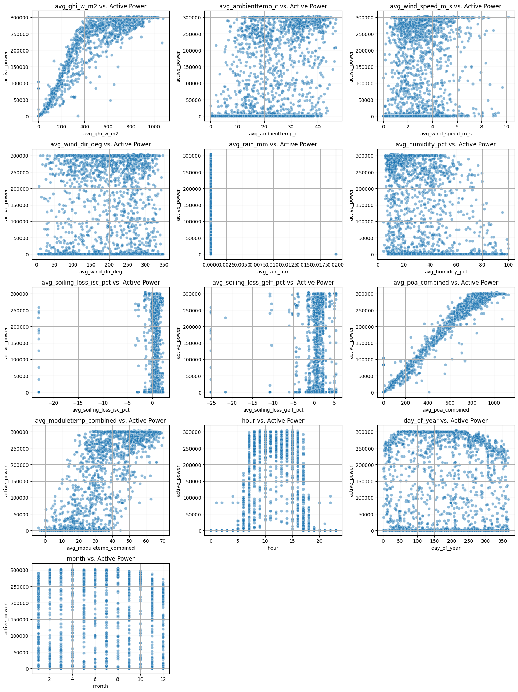
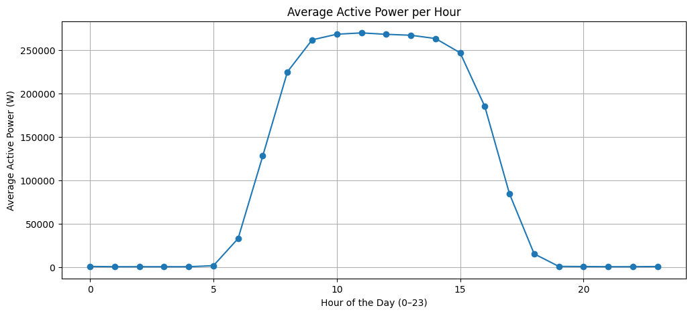
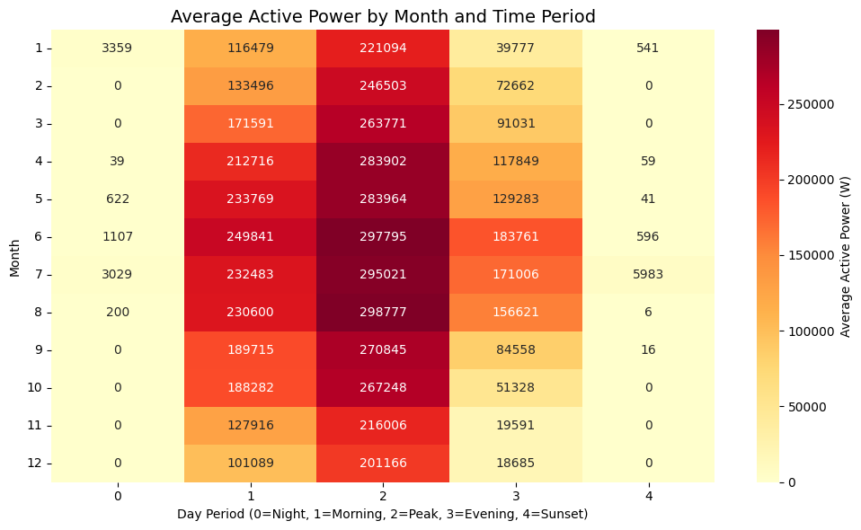
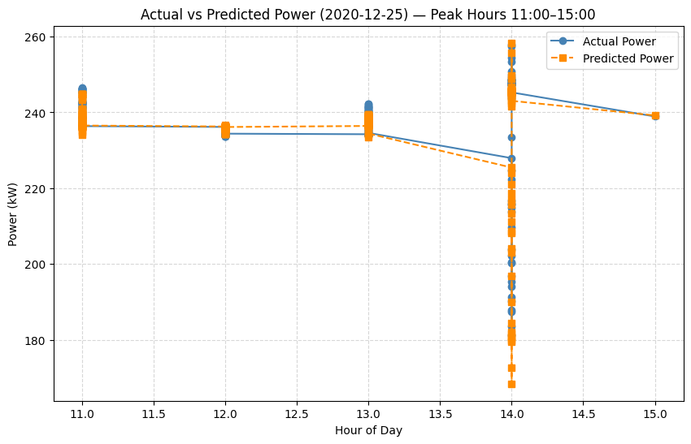
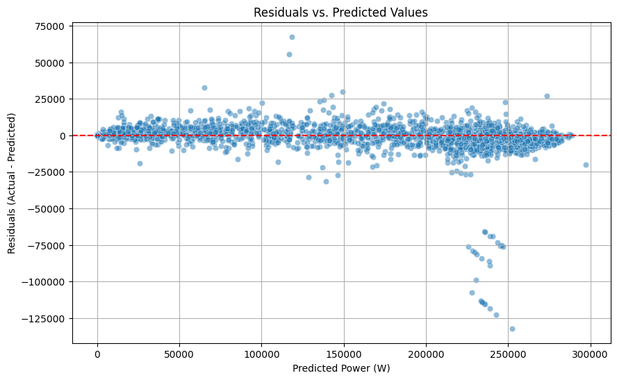
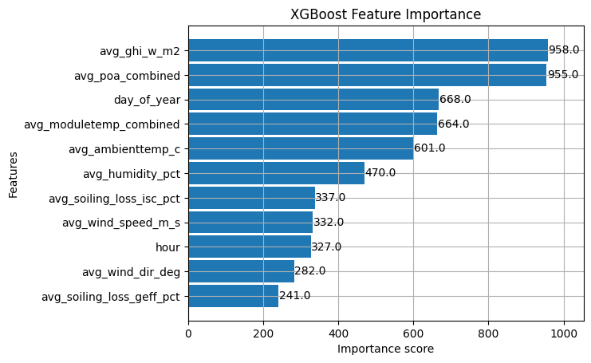
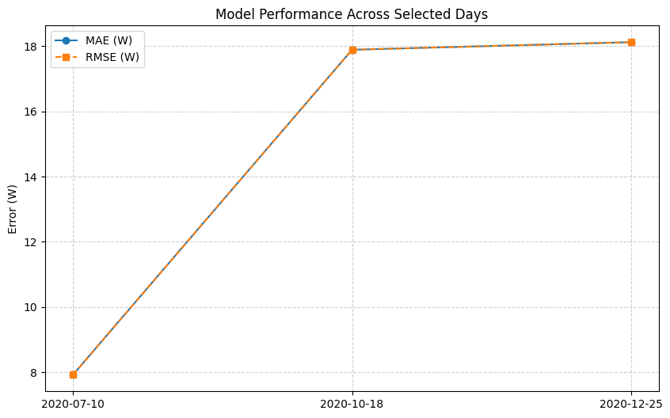

#  Solar Power Forecasting System  
**Spark Internship Project — AI UNIT, King Khalid University**

---

##  Overview

This project presents a **machine learning–based solar power forecasting system** trained on real solar panel sensor data collected over a full year with minute-level resolution.  
The system predicts **active power output (W)** based on irradiance, temperature, and environmental features.  
Two models were developed and compared:
- **LightGBM Forecasting Model (15-minute aggregation)**
- **XGBoost Predictive Model (1-hour aggregation)**

The **15-minute LightGBM** model achieved higher accuracy and better short-term forecasting stability.

---

##  Objectives
- Predict **real-time solar power output** with high accuracy.  
- Handle **seasonal and non-linear variations** in irradiance and temperature.  
- Deploy a **Flask web app** for real-time prediction and visualization.  
- Compare forecasting intervals (hourly vs. 15-min).  
- Provide clear visual analysis and system explainability.

---

##  Models Implemented

| Model Type | Algorithm | Interval | Target | R² (Test) | RMSE (W) |
|-------------|------------|-----------|----------|------------|------------|
| Forecasting | LightGBM | 15 min | Active Power | 0.996 | 6,450 |
| Predictive | XGBoost | 1 hour | Active Power | 0.993 | 8,034 |

---

##  Features Used

| Category | Feature | Description |
|-----------|----------|-------------|
| **Irradiance** | `avg_poa_combined`, `avg_ghi_w_m2` | Plane-of-array and global horizontal irradiance |
| **Temperature** | `avg_moduletemp_combined`, `avg_ambienttemp_c` | Module & ambient temperature |
| **Humidity** | `avg_humidity_pct` | Air humidity percentage |
| **Temporal** | `hour`, `day_of_year`, `month` | Time indicators |
| **Cyclical Encoding** | `sin_hour`, `cos_hour`, `sin_day`, `cos_day` | Smooth encoding of time cycles |
| **Autoregressive** | `lag_1`, `lag_2`, `lag_4`, `lag_8`, `lag_16` | Historical lagged active power |
| **Rolling Stats** | `roll_mean_4`, `roll_std_4` | Local mean and variation in recent intervals |

---

##  Hyperparameters (Optimized via GridSearchCV)

| Parameter | Value |
|------------|--------|
| `learning_rate` | 0.05 |
| `num_leaves` | 63 |
| `max_depth` | 8 |
| `min_child_samples` | 20 |
| `n_estimators` | 300 |
| `subsample` | 0.9 |
| `colsample_bytree` | 0.9 |
| `random_state` | 42 |

**Validation Strategy:**  
TimeSeriesSplit with `n_splits=5` to ensure temporal consistency.

---

##  Mathematical Representation

Cyclical encoding ensures smooth time transitions:
\[
\sin_{hour} = \sin\left(\frac{2 \pi \times hour}{24}\right), \quad
\cos_{hour} = \cos\left(\frac{2 \pi \times hour}{24}\right)
\]

\[
\sin_{day} = \sin\left(\frac{2 \pi \times day\_of\_year}{365}\right), \quad
\cos_{day} = \cos\left(\frac{2 \pi \times day\_of\_year}{365}\right)
\]

---

##  Visual Results

| Visualization | Description |
|----------------|-------------|
|  | Correlation heatmap between major features |
|  | Relationship between features and target |
|  | Distribution of active power by time of day |
|  | Power production pattern throughout the day |
|  | Predicted vs. Actual during peak hours |
|  | Full-day prediction comparison |
|  | XGBoost model result comparison |
|  | Night vs daytime irradiance data |
|  | Flask web interface demo |

---

##  Flask Web Deployment

A **Flask-based interactive web app** allows users to:
- Input real solar data manually or use automatic time detection.
- Generate instant predictions from the trained model.
- Automatically reset the page after refresh for a clean interface.

---

##  Acknowledgment

> We would like to express our sincere gratitude to our supervisor  
> **[Eng. Mohammed Mohana ](https://[[(https://www.linkedin.com/in/mohdmohana/)]([https://www.linkedin.com/in/njoud-abdulaziz-26a47b208/](https://www.linkedin.com/in/mohdmohana/))])**,  
> for his constant support, patience, and motivation throughout this project.  
> Despite his busy schedule, he always found time to provide guidance, share insights, and encourage us to dive deeper into new technical areas.  
> His mentorship not only made this project possible but also inspired us to pursue excellence in the field of **AI and renewable energy**.

---

##  Author

 **Nejood A. Bin Eshaq**  
MSc in Computer Science — King Khalid University  
🔗 [LinkedIn Profile](https://[[www.linkedin.com/in/nejood-bin-eshaq](https://www.linkedin.com/in/njoud-abdulaziz-26a47b208/)])
🔗 [Eng. Mohammed Mohana ](https://[[www.linkedin.com/in/nejood-bin-eshaq](https://www.linkedin.com/in/mohdmohana/)])

---

##  Technologies

`Python` • `LightGBM` • `XGBoost` • `Pandas` • `NumPy` • `Matplotlib` • `Flask` • `Scikit-Learn`

---

 **If you find this project useful, please give it a star!**
